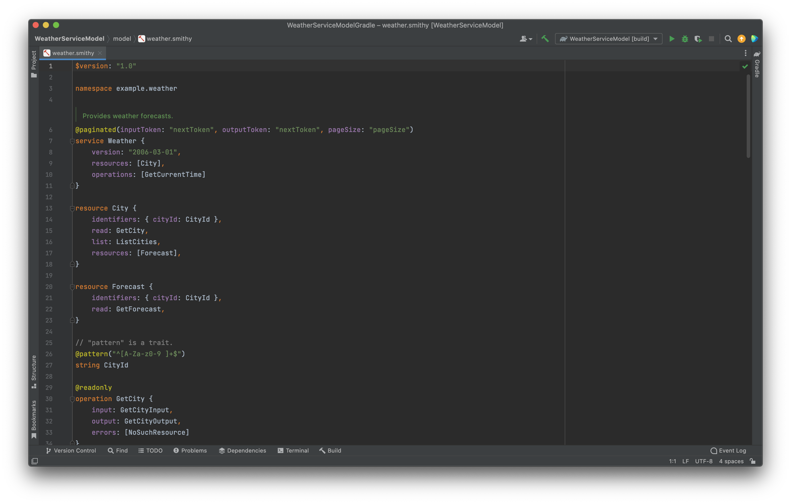
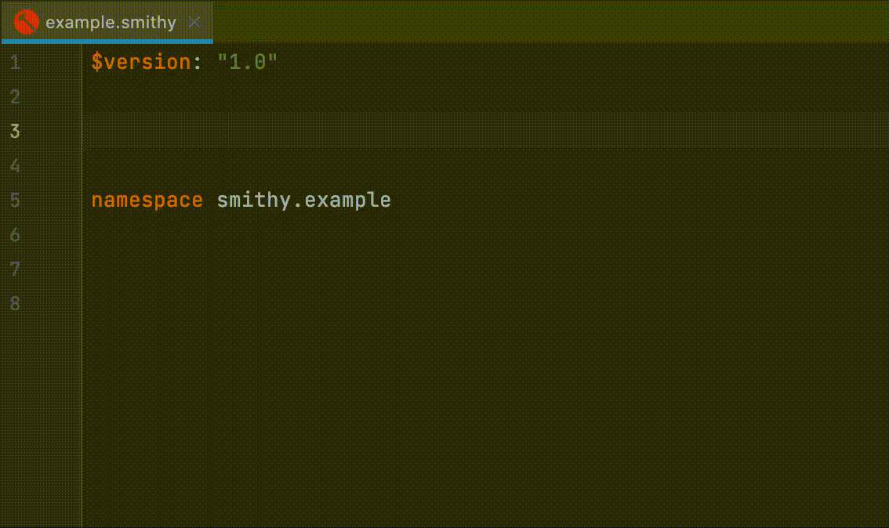
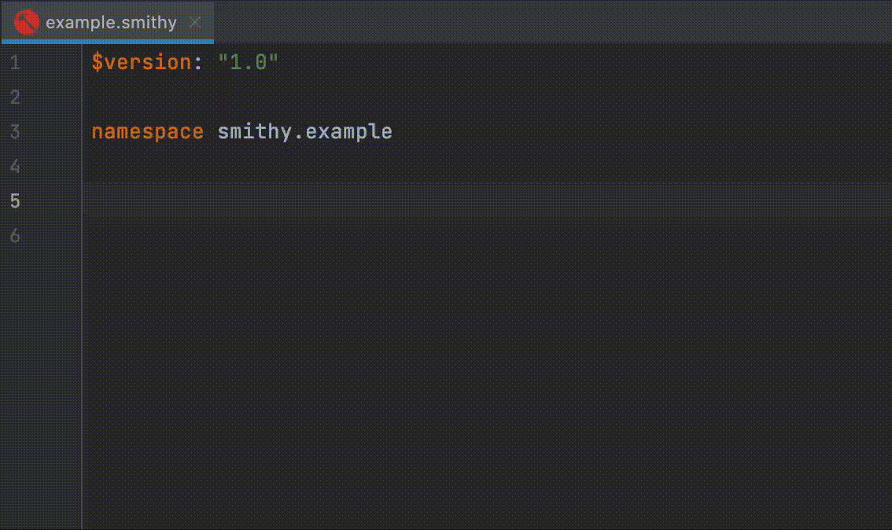
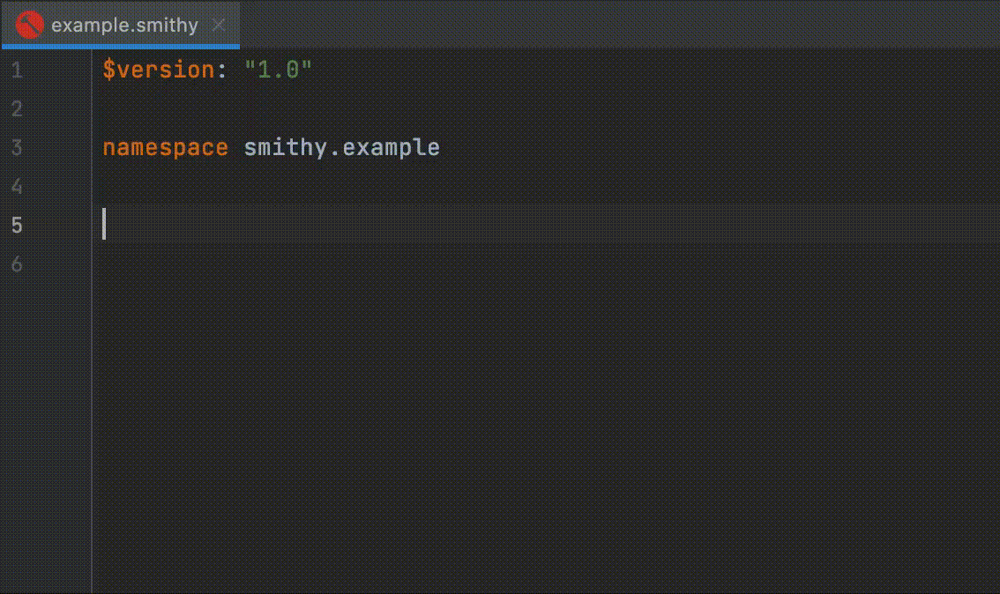

# [Smithy IntelliJ Plugin](https://plugins.jetbrains.com/plugin/18717-smithy)

 

IntelliJ plugin for the [Smithy](https://awslabs.github.io/smithy) interface definition language.

**Features**

- Code Completion
- Documentation Rendering (Markdown -> HTML)
- Formatting
- Live Templates
- Refactoring
- Syntax highlighting (customizable)

### Live Templates

Live templates are provided for all top-level statements within [Smithy](https://awslabs.github.io/smithy). Listed below
are some previews of the template functionality.

**Metadata**

**List**

**Map**

**Set**

**Simple Shape**

